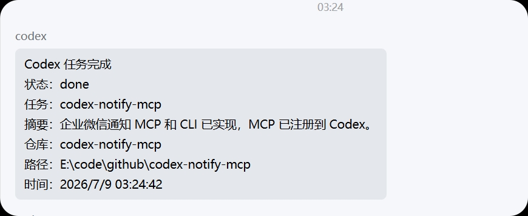

# codex-notify-mcp

Codex 任务完成后发送企业微信通知。这个项目提供两种入口：

- MCP 工具：给 Codex 暴露 `notify_wecom`，让 Codex 在任务完成前主动发通知。
- CLI 命令：可以被 hook、脚本或手动命令调用，直接向企业微信 webhook 发消息。

## 效果截图



## 配置

不要把企业微信 webhook 写进源码。推荐放进本地 `.env`：

```powershell
WECOM_WEBHOOK_URL=https://qyapi.weixin.qq.com/cgi-bin/webhook/send?key=YOUR_KEY_HERE
CODEX_NOTIFY_DEFAULT_TITLE=Codex 任务完成
CODEX_NOTIFY_REPO=codex-notify-mcp
```

`.env` 已加入 `.gitignore`。如果不想用 `.env`，也可以直接设置环境变量：

```powershell
$env:WECOM_WEBHOOK_URL="https://qyapi.weixin.qq.com/cgi-bin/webhook/send?key=YOUR_KEY_HERE"
```

## 作为 MCP 接入 Codex

在本仓库目录执行：

```powershell
codex mcp add wecom-notify --env CODEX_NOTIFY_ENV_FILE="E:\code\github\codex-notify-mcp\.env" -- node E:\code\github\codex-notify-mcp\src\server.mjs
```

之后在 Codex 的长期指令或仓库 `AGENTS.md` 中加入类似规则：

```text
每次任务完成并准备回复用户前，调用 wecom-notify MCP 的 notify_wecom 工具发送企业微信通知。
通知内容包含任务状态、简短摘要、仓库名和当前路径。
```

## 手动发送测试

```powershell
node src\cli.mjs --title "Codex 任务完成" --status done --task "通知测试" --summary "企业微信 webhook 已可用"
```

## 可用环境变量

- `WECOM_WEBHOOK_URL`：必填，企业微信机器人 webhook 地址。
- `CODEX_NOTIFY_ENV_FILE`：可选，指定 `.env` 文件路径。
- `CODEX_NOTIFY_DEFAULT_TITLE`：可选，默认通知标题。
- `CODEX_NOTIFY_REPO`：可选，默认仓库名。
- `CODEX_NOTIFY_CWD`：可选，默认工作目录。

## MCP 工具参数

工具名：`notify_wecom`

参数：

- `title`：通知标题。
- `status`：任务状态，例如 `done`、`failed`、`needs attention`。
- `task`：任务名。
- `summary`：任务摘要。
- `repo`：仓库名。
- `cwd`：当前路径。

